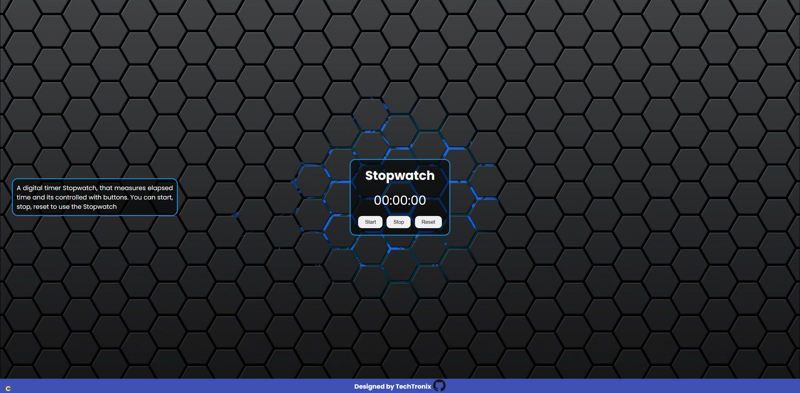

# Stopwatch

A digital timer Stopwatch that measures elapsed time and is controlled with buttons. You can start, stop, and reset the Stopwatch.

## Features

- Start, stop, and reset the stopwatch
- Display elapsed time in minutes, seconds & milliseconds

## Demo
Demo - [Link](https://stopwatch-webapp.vercel.app/)

## Usage

To use the stopwatch, simply open the `index.html` file in a web browser. The stopwatch can be controlled using the buttons on the page.

## License

This project is licensed under the [MIT License](LICENSE).
